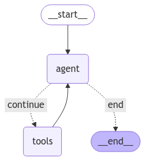

# Langgraph-Example-Agent

This repo is an example on how to set up a simple, async graph structure using Langgraph and Asyncio. 
Inspiration for this project was taken from this site: https://langchain-ai.github.io/langgraph/how-tos/react-agent-from-scratch/

This is the state of the graph:

